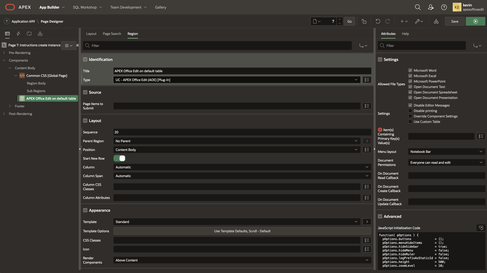
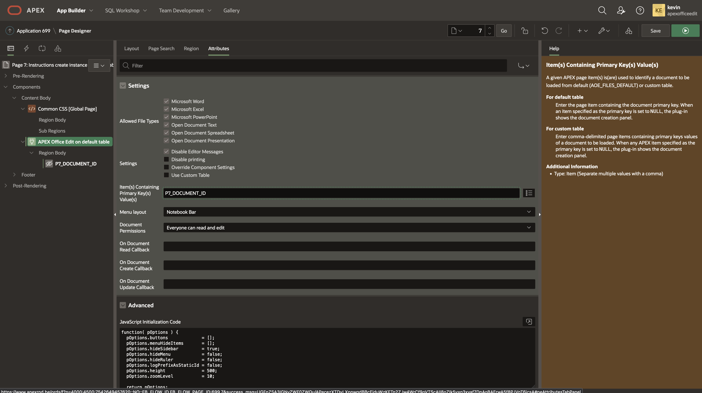
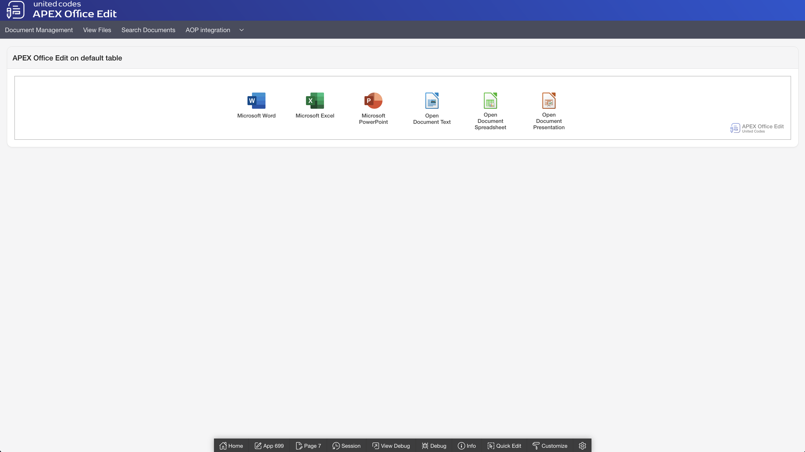
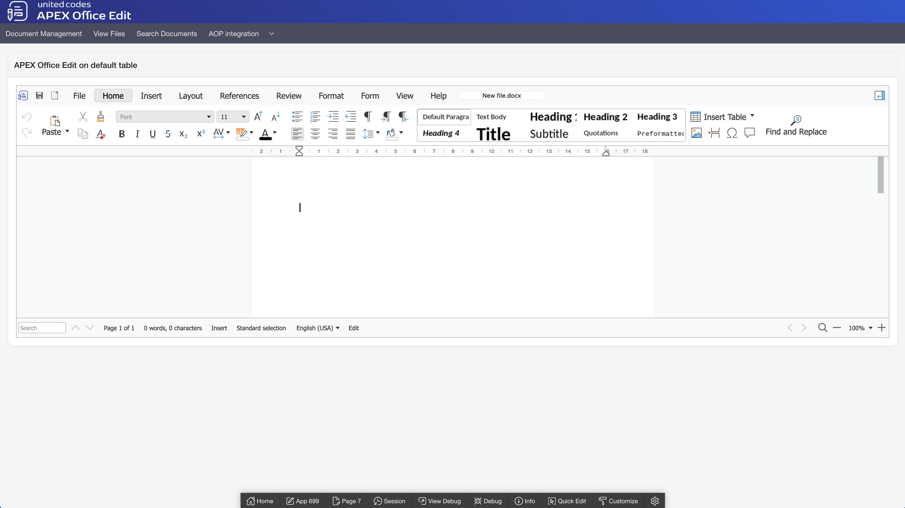
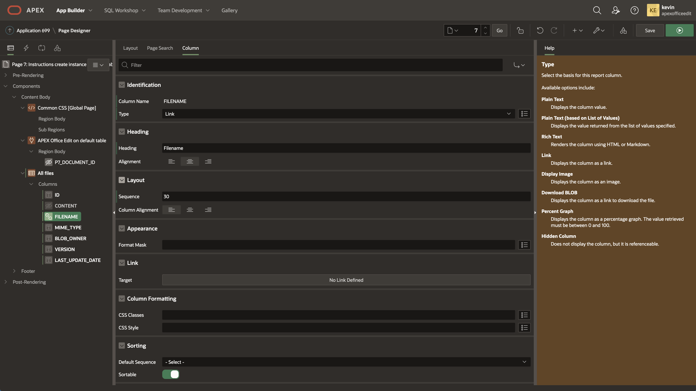
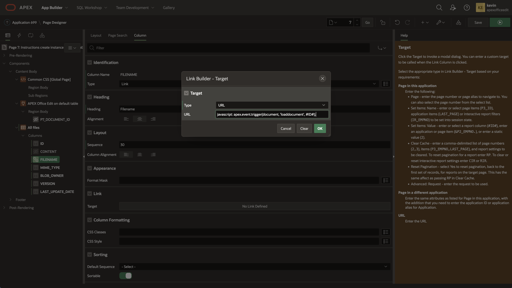
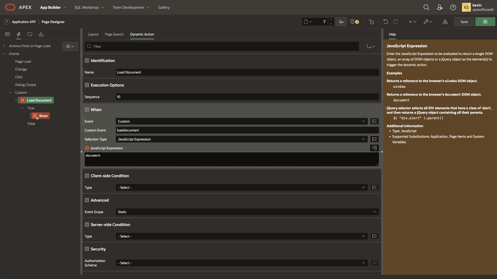
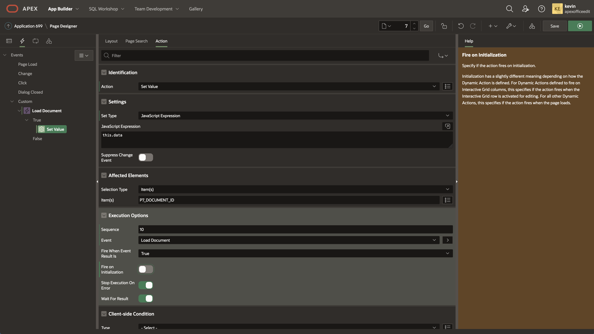
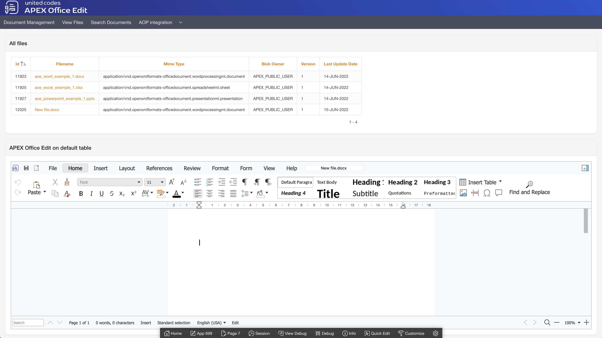

# Creating the plug-in instance in an existing application

This section describes the first steps of how to create the plug-in instance implementing APEX Office Edit. If any plug-in attribute purpose is not clear, please read the help texts defined for Oracle APEX page designer.

## Default table

### Create a new page

1. Create a new empty page

### Create the plug-in region

1. Create a new region
2. Set **Identification \ Title** to **APEX Office Edit on default table**
3. Change **Indentification \ Type** to **UC - APEX Office Edit (AOE) [Plug-in]**

### Create APEX item containing document ID

1. Create page item 
2. Set **Identification \ Name** to **P7_DOCUMENT_ID**
3. Change **Type** to **Hidden**
4. Set **Settings \ Value Protected** to **No**

### Configure the plug-in 

1. Go to region **APEX Office Edit on default table \ Attributes**
2. Set **Item Containing Primary Key Value** to **P7_DOCUMENT_ID**
3. Save and run the page

### Testing the plug-in

In the result, the plug-in is prepared to start creating a first document. Clicking on document icon creates a blank document of selected type. 

***

# Loading documents into APEX Office Edit

This section describes the first steps of how to load documents into APEX Office Edit. The plug-in state is based on `APEX Session State` for page items defined as primary key(s). If the given item(s) is/are NULL the plug-in shows a panel allowing the end-user to create a new document. In order to load a document to the AOE, item(s) must not be NULL, and the plug-in configuration must be valid.

## Default table

The instructions presented below are meant to be the continuation of **Creating the plug-in instance in an existing application**.

### Create classic report showing all created files

1. Create a new page region
2. Set **Identification \ Title** to **All files**
3. Set **Indentification \ Type** to **Classic Report**
4. Set **Source \ Table Name** to **AOE_FILES_DEFAULT**
5. Select column **CONTENT** in **All files \ Columns tree**
6. Set **Identification \ Type** to **Hidden Column**

### Define link on column FILENAME

1. Select column **FILENAME in All files \ Columns tree**
2. Set **Identification \ Type** to **Link**

1. Click button **No Link Defined** in **Link \ Target**

2. Set **Target \ Type** to **URL**

3. Set **URL** to javascript: 

   `javascript: apex.event.trigger(document, 'loaddocument', #ID#);`

1. Click button **OK**
2. Go to the next step to create a dynamic action

### Create dynamic action enforcing loading a file

1. Create a new dynamic action
2. Set **Identification \ Name** to **Load document**
3. Set **When \ Event** to **Custom**
4. Set **When \ Custom Event** to **loaddocument**
5. Set **When \ Selection Type** to **JavaScript Expression**
6. Set **When \ JavaScript Expression** to **document**

### Define true actions

1. Select default **Show** action
2. Set **Identification \ Action** to **Set Value**
3. Set **Settings \ Set Type** to **JavaScript Expression**
4. Set **Settings \ JavaScript Expression** to **this.data**
5. Set **Affected Elements \ Item(s)** to **P7_DOCUMENT_ID**
6. Set **Execution Options \ Fire on Initialization** to **No**

1. Create a new true action
2. Set **Identification \ Action** to **Refresh**
3. Set **Affected Elements \ Selection Type** to **Region**
4. Set **Affected Elements \ Region** to **APEX Office Edit on default table**

1. Move region All files above region APEX Office Edit on default table
2. Save and run the page

Region column filename contains links. Clicking on a link will force APEX Office Edit to load the selected document by setting the primary key item and refreshing the region implementing the plug-in.

***