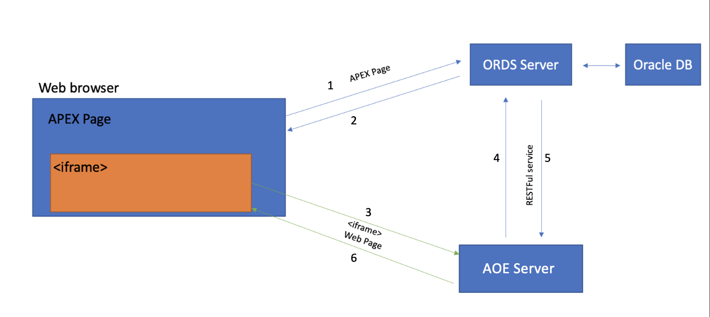

# Server
## Architecture and General Flow



***High Level Architecture Diagram of AOE***


***General Work flow between ORDS and AOE***


## Hardware Requirements

Operating System: Linux, Mac OS, Windows (any other OS that supports Docker)

Other requirements are as follows:

- 10 users/ CPU thread
- 100Mb RAM / user
- 100kbits / user

## Running APEX Office Edit Server

### Docker Installation

Firstly, make sure docker is installed on the machine, if not install Docker.

The detailed steps to install docker in Ubuntu can be found on:

<https://docs.docker.com/engine/install/ubuntu/>

For other environments refer to: <https://docs.docker.com/engine/install/>

Docker installation can be checked as:

```sh
docker --version
```

It will return output as:

Docker version \<version number\>, build \<id\>

Example: Docker version 20.10.12, build e91ed57

### AOE Image

Pull the image of AOE from official registry.
```sh
docker pull uc/aoe:initial
```

### AOE Container

After downloading the image of AOE, new container can be run as follow:

docker run -p 80:80 -e \"domain=\<dot-escaped-ords-server\>\" \--name aoe -d \--restart always uc/aoe:initial

Example:
```sh
docker run -p 80:80 -e "domain=wopi\\.apexrnd\\.be\" --name aoe -d --restart always uc/aoe:initial
```

Please check out all the configuration options that are available.

**-p** parameter specifies the port to be bound with exposed port of
docker. If a different port is wished on the machine this can be changed
with -p 8030:80. By default AOE docker container exposes port 80.

**\--name** parameter can be used to identify the running container. If
a container name with the \--name option is not assigned, then the
daemon generates a random string name. Defining a name can be a handy
way to add meaning to a container. If name is specified, it can be used
when referencing the container within a Docker network. This works for
both background and foreground Docker containers.

**-e** command line option of docker run command defines environment
variables that are passed to the container.

\<dot-escaped-ords-server\> is the address of the server running ORDS,
that implements WOPI protocol, for example 10\\\\.2\\\\.60\\\\.2 or
wopi\\\\.example\\\\.com. Double backslash is needed in command line,
because shell escapes the first, and the domain parameter takes a
regular expression. Multiple domains can be set by separating the domain
names with \| character.

The optional username and password parameters enable the admin console
feature of APEX Office Edit. Admin panel can be accessed through

http(s)://\<SERVER Domain\>/browser/dist/admin/admin.html or

<http://localhost:8030/browser/dist/admin/admin.html> from the server
running docker. The port needs to be changed to configured port number
while running the container. Also, admin username and password have to
be provided while running the docker instance as:

```sh
docker run -p 80:80 -e 'domain=wopi\\.apexrnd\\.be' -e 'username=admin' -e 'password=oracle' \
       --name aoe -d --restart always uc/aoe:initial
```
The other general run parameters can be found on:

<https://docs.docker.com/engine/reference/run/>

For constraining the memory and available CPU for the running container
please refer to:

<https://docs.docker.com/engine/reference/run/#runtime-constraints-on-resources>

Memory and CPU Limitation:
<table>
    <tr>
        <td style="white-space: nowrap;" >-m, --memory="" </td>
        <td> Memory limit (format: <number>[<unit>]). Number is a positive integer. Unit can be one of b, k, m, or g.
                    Minimum is 4M.</td>
    <tr>
        <td >--cpus=value</td>
        <td>Specify how much of the available CPU resources a container can use. For instance, if the host machine has
            two CPUs and you set --cpus="1.5", the container is guaranteed at most one and a half of the CPUs </td>
    </tr>
</table>

The limitations and stats can be found by running:
```sh
docker stats
```
For SSL configuration settings see [Network
Configuration](#network-configuration).

### Steps to activate AOE

In order to activate APEX Office Edit, firstly run the AOE container
(aoe) then execute following command to access shell inside docker

docker exec -u root -it ***\<container_name or container_id\>*** /bin/bash

Example:
```sh
docker exec -u root -it aoe /bin/bash
```
After that change the directory to *APEXOfficeEdit*
```sh
cd /APEXOfficeEdit
```
Then activate the AOE as follow:

*./AOEInterfaceLinux64 -a \--email **\<email address\>***

Example:
```sh
./AOEInterfaceLinux64 -a --email test@aoe.com
```

Optionally, proxy can also be specified (if required) as follow:

*./AOEInterfaceLinux64 -a \--email **\<email address\>*** \--proxy **\<proxy url or boolean\>**

Proxy URL can be directly given with proxy parameter.

If Boolean value like true or false is given, then proxy URL needs to be
to environment variable "http_proxy"

process.env.http_proxy=***\<proxy url\>***

If the process is successful a file with filename "aoe.license" will be
created in the same directory.

Afterwards, exit from the docker shell by using key combination `Ctrl` `+` `D`
**or** just type

```sh
exit
```

Once this is completed restart the docker instance as:

docker restart ***\<container_name or container_id\>***

Example:
```sh
docker restart aoe
```
### Steps to re-activate AOE

Similar to activation of AOE, reactivation can be done by accessing the
shell of the running container as follow:

docker exec -u root -it ***\<container_name or container_id\>***
/bin/bash

Example:
```sh
docker exec -u root -it aoe /bin/bash
```
After that change the directory to *APEXOfficeEdit*
```sh
cd /APEXOfficeEdit
```
Then re-activate the AOE as follow:
```sh
./AOEInterfaceLinux64 -r
```

Note: For reactivation process, license file should be present (i.e. AOE
should be activated already)

AOE expects license file to be on same directory, if it is saved at
different location then license arguments can be given to indicate the
path of file as:

*./AOEInterfaceLinux64 -r \--license **\<path of file\>***

Example:
```sh
./AOEInterfaceLinux64 -r --license /home/auth/aoe.license
```
Optionally, proxy can also be specified (if required) as follow:

*./AOEInterfaceLinux64 -r \--license **\<path of file\>*** \--proxy
**\<proxy URL or Boolean\>**

Proxy URL can be directly given with proxy parameter.

If Boolean value like true or false is given, then proxy URL needs to be
to environment variable "http_proxy"

process.env.http_proxy=***\<proxy url\>***

Afterwards, exit from the docker shell by using key combination Ctrl+D
**or** just type
```sh
exit
```

Once this is completed restart the docker instance as:

docker restart ***\<container_name or container_id\>***

Example:
```sh
docker restart aoe
```

### Steps to deactivate AOE

Firstly, access the shell of the running container as follow:

docker exec -u root -it ***\<container_name or container_id\>***
/bin/bash

Example:
```sh
docker exec -u root -it aoe /bin/bash
```
After that change the directory to *APEXOfficeEdit*
```sh
cd /APEXOfficeEdit
```
Then re-activate the AOE as follow:
```sh
./AOEInterfaceLinux64 -d
```
Note: For deactivation process, license file should be present (i.e. AOE
should be activated already)

AOE expects license file to be on same directory, if it is saved at
different location then license arguments can be given to indicate the
path of file as:

*./AOEInterfaceLinux64 -d \--license **\<path of file\>***

Example:
```sh
./AOEInterfaceLinux64 -d --license /home/auth/aoe.license
```
Afterwards, exit from the docker shell by using key combination Ctrl+D
**or** just type
```sh
exit
```
Once this is completed copy out the deactivation request file from the
docker instance as:

docker cp ***\<container_name or container_id\>***:/APEXOfficeEdit/aoe_deactivation.request aoe_deactivation.request

It will copy the file to local machine, which can be sent to AOE support
team for further deactivation process.

Also, docker container can be stopped as:

docker stop ***\<container_name or container_id\>***

Example:
```sh
docker stop aoe
```

### Other options

Other different options are also available and can be viewed as:
```sh
./AOEInterfaceLinux64 --help
```
It will display available options:

Usage: AOE Utils \[options\]

AOE utility for licensing and configuring.

Options:
```py
-v, --version Show version information

-a, --activate Activate License

-r, --reactivate Reactivate License

-d, --deactivate Deactivate License. Creates deactivation request file.

-p, --port [port] Port number to listen on. (default: 80)

--license [path] File path of license file (default:"./aoe.license")

--email [email] Email address of license holder

--proxy [proxy] Proxy to use (default: false)

--docs Documentation

--examples Examples

--mid Display Machine ID

-h, --help Show help
```

## Configuring APEX Office Edit

Apart from the configuration mentioned in section above, the extra
configurations can be changed from /etc/coolwsd/coolwsd.xml
configuration file.

### Modifying and saving the changes

Before looking at the configuration possibilities, here are the steps
that need to be taken to modify and save the changes.

After starting the container, it is possible to copy the configuration
file out of the container, edit it, and copy it back to the container.
The container will notice that the configuration file has changed, and
the service will be restarted (don't forget the \--restart always option
when starting the container with docker run).

1\. Find out the name or hash of your container:
```sh
docker ps
```
The output would be something like this:


2\. Copy out the config file:
```sh
docker cp aoe:/etc/coolwsd/coolwsd.xml coolwsd.xml
```
3\. Edit the config file with editor, then save and copy it back to the
container:
```sh
docker cp coolwsd.xml aoe:/etc/coolwsd/coolwsd.xml
```
Wait a few seconds for the automatic restart.

#### Troubleshooting

After starting of the container, try:
```sh
curl -k http(s)://localhost:9980
```
You should get the OK string, if everything is in order. Otherwise, you can check the log with:

```sh
docker logs aoe
```
(Instead of aoe might be something different if name was changed while running docker run)

If the docker doesn't restart automatically, it can be restarted using command:

docker restart \<container_id or container_name\>

Example:
```sh
docker restart aoe
```
### Configuration file

A lot of things can be configured from coolwsd.xml file. The file itself
contains comments which help with the configuration.

For example:

```xml
<!-- Note: 'default' attributes are used to document a setting's default value as well as to use as fallback. -->
<!-- Note: When adding a new entry, a default must be set in WSD in case the entry is missing upon deployment. -->
<allowed_languages desc="List of supported languages of Writing Aids (spell checker, grammar checker, thesaurus, hyphenation) on this instance. Allowing too many has negative effect on startup performance." default="de_DE en_GB en_US es_ES fr_FR it nl pt_BR pt_PT ru">de_DE en_GB en_US es_ES fr_FR it nl pt_BR pt_PT ru</allowed_languages>
```

#### Autosaving

The following section should be modified
```xml
<!-- Idle save and auto save are checked every 30 seconds -->
<!-- They are disabled when the value is zero or negative. -->
<idlesave_duration_secs desc="The number of idle seconds after which document, if modified, should be saved. Defaults to 30 seconds." type="int" default="30">30</idlesave_duration_secs>
<autosave_duration_secs desc="The number of seconds after which document, if modified, should be saved. Defaults to 5 minutes." type="int" default="300">300</autosave_duration_secs>
<always_save_on_exit desc="On exiting the last editor, always perform the save, even if the document is not modified." type="bool" default="false">false</always_save_on_exit>
```

#### Supported Languages

```xml
<allowed_languages desc="List of supported languages of Writing Aids (spell checker, grammar checker, thesaurus, hyphenation) on this instance. Allowing too many has negative effect on startup performance." default="de_DE en_GB en_US es_ES fr_FR it nl pt_BR pt_PT ru">
    de_DE en_GB en_US es_ES fr_FR it nl pt_BR pt_PT ru
</allowed_languages> 
```

#### Resource Optimization

On top of resource constraining, the resource can be optimized per
document and can be found under the document section. Key settings are
as follows:
```xml
<idle_timeout_secs desc="The maximum number of seconds before unloading an idle document. Defaults to 1 hour." type="uint" default="3600">
    3600
</idle_timeout_secs>
```
```xml
<limit_virt_mem_mb desc="The maximum virtual memory allowed to each document process. 0 for unlimited." type="uint">
  0
</limit_virt_mem_mb>
```

### Other configuration like fonts

Other configurations like fonts can be done by using the container
shell. Accessing the shell can be done by using the following command:

```sh
docker exec -it aoe /bin/bash
```

The APEX Office Edit container is based on Ubuntu 20.04. Once inside the
container, the usual Ubuntu commands can be used to install the required
fonts.

Easy guide for fonts:

• Copy the to install fonts into /usr/local/share/fonts

• Run fc-cache -fv

The fonts can be moved from the server to the container using:

```sh
docker cp font.ttf aoe:/user/local/share/fonts/font.ttf
```

### Network Configuration

For developing environment, the WOPI has been set to run using http. If
SSL is desired, it is recommended to use a proxy.

#### Setting up Apache 2 reverse proxy

(https://web.archive.org/web/20210504000148/https://www.collaboraoffice.com/code/apache-reverse-proxy/)

mod_proxy_wstunnel should be enabled on httpd.conf file.

The corresponding coolwsd settings are ssl.enable=false and
ssl.termination=true.

```
<VirtualHost *:443>
  ServerName wopi.unitedcodes.com:443
  Options -Indexes

  # SSL configuration, you may want to take the easy route instead and use Lets Encrypt!
  SSLEngine on
  SSLCertificateFile /path/to/signed_certificate
  SSLCertificateChainFile /path/to/intermediate_certificate
  SSLCertificateKeyFile /path/to/private/key
  SSLProtocol             all -SSLv2 -SSLv3
  SSLCipherSuite ECDHE-ECDSA-CHACHA20-POLY1305:ECDHE-RSA-CHACHA20-POLY1305:ECDHE-ECDSA-AES128-GCM-SHA256:ECDHE-RSA-AES128-GCM-SHA256:ECDHE-ECDSA-AES256-GCM-SHA384:ECDHE-RSA-AES256-GCM-SHA384:DHE-RSA-AES128-GCM-SHA256:DHE-RSA-AES256-GCM-SHA384:ECDHE-ECDSA-AES128-SHA256:ECDHE-RSA-AES128-SHA256:ECDHE-ECDSA-AES128-SHA:ECDHE-RSA-AES256-SHA384:ECDHE-RSA-AES128-SHA:ECDHE-ECDSA-AES256-SHA384:ECDHE-ECDSA-AES256-SHA:ECDHE-RSA-AES256-SHA:DHE-RSA-AES128-SHA256:DHE-RSA-AES128-SHA:DHE-RSA-AES256-SHA256:DHE-RSA-AES256-SHA:ECDHE-ECDSA-DES-CBC3-SHA:ECDHE-RSA-DES-CBC3-SHA:EDH-RSA-DES-CBC3-SHA:AES128-GCM-SHA256:AES256-GCM-SHA384:AES128-SHA256:AES256-SHA256:AES128-SHA:AES256-SHA:DES-CBC3-SHA:!DSS
  SSLHonorCipherOrder     on

  # Encoded slashes need to be allowed
  AllowEncodedSlashes NoDecode

  # Container uses a unique non-signed certificate
  SSLProxyEngine On
  SSLProxyVerify None
  SSLProxyCheckPeerCN Off
  SSLProxyCheckPeerName Off

  # keep the host
  ProxyPreserveHost On

  # static html, js, images, etc. served from loolwsd
  # loleaflet is the client part of LibreOffice Online
  ProxyPass           /loleaflet http://127.0.0.1:9980/loleaflet retry=0
  ProxyPassReverse    /loleaflet http://127.0.0.1:9980/loleaflet

  # WOPI discovery URL
  ProxyPass           /hosting/discovery http://127.0.0.1:9980/hosting/discovery retry=0
  ProxyPassReverse    /hosting/discovery http://127.0.0.1:9980/hosting/discovery

  # Capabilities
  ProxyPass           /hosting/capabilities http://127.0.0.1:9980/hosting/capabilities retry=0
  ProxyPassReverse    /hosting/capabilities http://127.0.0.1:9980/hosting/capabilities

  # Main websocket
  ProxyPassMatch "/lool/(.*)/ws$" ws://127.0.0.1:9980/lool/$1/ws nocanon

  # Admin Console websocket
  ProxyPass   /lool/adminws ws://127.0.0.1:9980/lool/adminws

  # Download as, Fullscreen presentation and Image upload operations
  ProxyPass           /lool http://127.0.0.1:9980/lool
  ProxyPassReverse    /lool http://127.0.0.1:9980/lool
</VirtualHost>
```

#### Setting up Nginx reverse proxy

(https://web.archive.org/web/20210924112039/https://www.collaboraoffice.com/code/nginx-reverse-proxy/)

The corresponding loolwsd settings are ssl.enable=false and ssl.termination=true.
```
server {
    listen       443 ssl;
    server_name  wopi.unitedcodes.com:443;

    ssl_certificate /path/to/ssl_certificate;
    ssl_certificate_key /path/to/ssl_certificate_key;

    # static files
    location ^~ /loleaflet {
        proxy_pass http://localhost:9980;
        proxy_set_header Host $http_host;
    }

    # WOPI discovery URL
    location ^~ /hosting/discovery {
        proxy_pass http://localhost:9980;
        proxy_set_header Host $http_host;
    }

    # Capabilities
    location ^~ /hosting/capabilities {
        proxy_pass http://localhost:9980;
        proxy_set_header Host $http_host;
    }

    # main websocket
    location ~ ^/lool/(.*)/ws$ {
        proxy_pass http://localhost:9980;
        proxy_set_header Upgrade $http_upgrade;
        proxy_set_header Connection "Upgrade";
        proxy_set_header Host $http_host;
        proxy_read_timeout 36000s;
    }

    # download, presentation and image upload
    location ~ ^/lool {
        proxy_pass http://localhost:9980;
        proxy_set_header Host $http_host;
    }

    # Admin Console websocket
    location ^~ /lool/adminws {
        proxy_pass http://localhost:9980;
        proxy_set_header Upgrade $http_upgrade;
        proxy_set_header Connection "Upgrade";
        proxy_set_header Host $http_host;
        proxy_read_timeout 36000s;
    }
}
```

#### Setting up SSL certificate without proxy

If a valid SSL certificate is present, the certificate file and the pem
file can be moved to the docker container. The files will need to be
configured in the coolwsd file:

```xml
<ssl desc="SSL settings">
    <enable type="bool" desc="Controls whether SSL encryption between browser and loolwsd is enabled (do not disable for production deployment). If default is false, must first be compiled with SSL support to enable." default="true">true</enable>
    <termination desc="Connection via proxy where loolwsd acts as working via https, but actually uses http." type="bool" default="true">false</termination>
    <cert_file_path desc="Path to the cert file" relative="false">/etc/loolwsd/cert.pem</cert_file_path>
    <key_file_path desc="Path to the key file" relative="false">/etc/loolwsd/key.pem</key_file_path>
    <ca_file_path desc="Path to the ca file" relative="false">/etc/loolwsd/ca-chain.cert.pem</ca_file_path>
    <cipher_list desc="List of OpenSSL ciphers to accept" default="ALL:!ADH:!LOW:!EXP:!MD5:@STRENGTH"></cipher_list>
    <hpkp desc="Enable HTTP Public key pinning" enable="false" report_only="false">
        <max_age desc="HPKP's max-age directive - time in seconds browser should remember the pins" enable="true">1000</max_age>
        <report_uri desc="HPKP's report-uri directive - pin validation failure are reported at this URL" enable="false"></report_uri>
        <pins desc="Base64 encoded SPKI fingerprints of keys to be pinned">
            <pin></pin>
        </pins>
    </hpkp>
</ssl>
```

#### SSL termination (when using proxy)

When docker image is behind a proxy which usages https but connects to
docker image through plain http, the termination option should be set to
true. This will cause the WOPI page to use secure WebSocket protocol
instead of plain WebSocket.

```xml
<termination desc="Connection via proxy where loolwsd acts as working via https, but actually uses http." type="bool" default="true">
  false
</termination>
```

### Configuring WOPI Server URL in APEX pages

In the APEX page with WOPI file frame, there is a page item named:

PXX_WOPI_ACTION_URL

The value of this page item should be changed so that it points to the
WOPI server:

http(s)://\<Your server running WOPI \>/browser/a21322665/cool.html

or for example

http://10.2.60.40/browser/a21322665/cool.html

Please make sure that this server is reachable by the client.

### Adding IP as allowed hosts

If a new URL (or host) needs access to WOPI, the domain name or the IP
address should be whitelisted or allowed. This can be done by editing
the network settings in the coolwsd.xml file.

```xml
<post_allow desc="Allow/deny client IP address for POST(REST)." allow="true">
    <host desc="The IPv4 private 192.168 block as plain IPv4 dotted decimal addresses.">
      192\.168\.[0-9]{1,3}\.[0-9]{1,3}
    </host>
    <host desc="Ditto, but as IPv4-mapped IPv6 addresses">::ffff:192\.168\.[0-9]{1,3}\.[0-9]{1,3}</host>
    <host desc="The IPv4 loopback (localhost) address.">127\.0\.0\.1</host>
    <host desc="Ditto, but as IPv4-mapped IPv6 address">::ffff:127\.0\.0\.1</host>
    <host desc="The IPv6 loopback (localhost) address.">::1</host>
    <host desc="The IPv4 private 172.17.0.0/16 subnet (Docker).">172\.17\.[0-9]{1,3}\.[0-9]{1,3}</host>
    <host desc="Ditto, but as IPv4-mapped IPv6 addresses">::ffff:172\.17\.[0-9]{1,3}\.[0-9]{1,3}</host>
</post_allow>
```